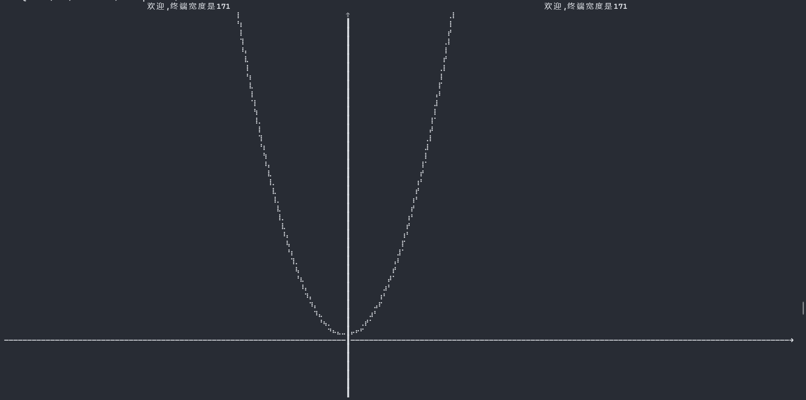
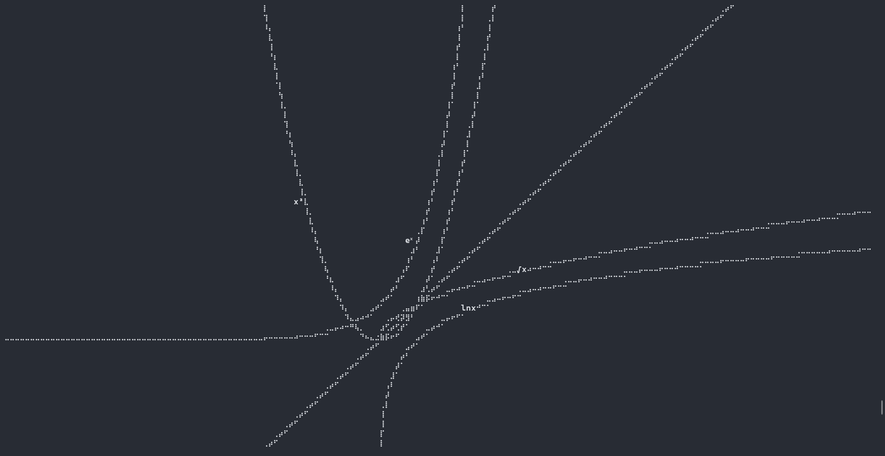
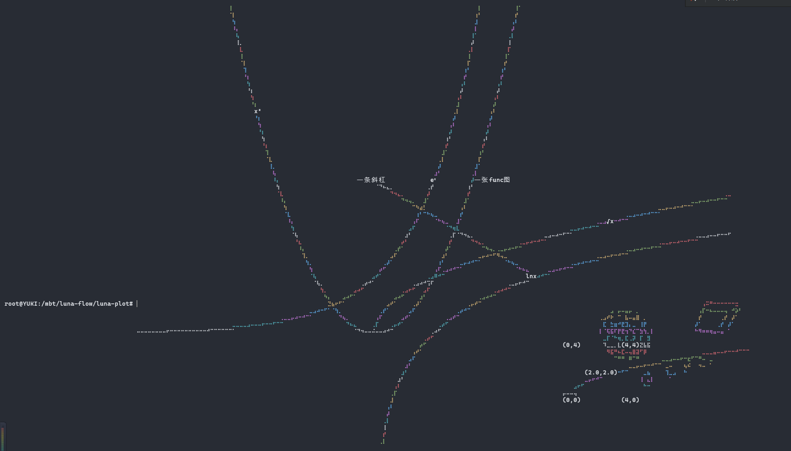

# Luna Plot
[简体中文](README.md) | [English](README_EN.md)

Luna Plot 是一个基于 MoonBit 的数据可视化库，专注于提供简洁、高效的图表、图形、视图绘制功能。

## 功能特性

1.快速绘制多种函数图形。插入便捷标签。覆盖坐标轴。
2.基于函数绘制引擎的，简单的2d/3d引擎
3.简易动画输出功能（见工程内示例

## 配置依赖运行示例

使用 MoonBit 包管理器安装：

```bash
moon add Kaida-Amethyst/math
moon add moonbitlang/x
```
## 快捷启动
运行./build.sh。若要自行编译，请取消第一行注释。并且更改native-zig的编译路径为自身路径（用别的后端编译也可以）：
```src/main/moon.pkg.json]
"link": {
    "native": {
      "flags": [
        "-cc",
        "/D/zig/zig.exe cc -target riscv64-linux-musl -O2 -static"
        //这里改为自己的zig路径
      ]
    }
  }
```
## 示例
具体代码详见src/main/main.mbt。以下给出图片示例：

单函数绘制（最基础

多函数绘制

3d视图与anim

支持图幅嵌入
