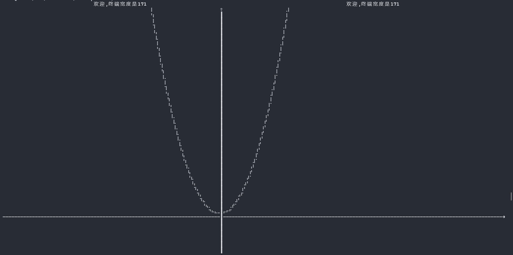
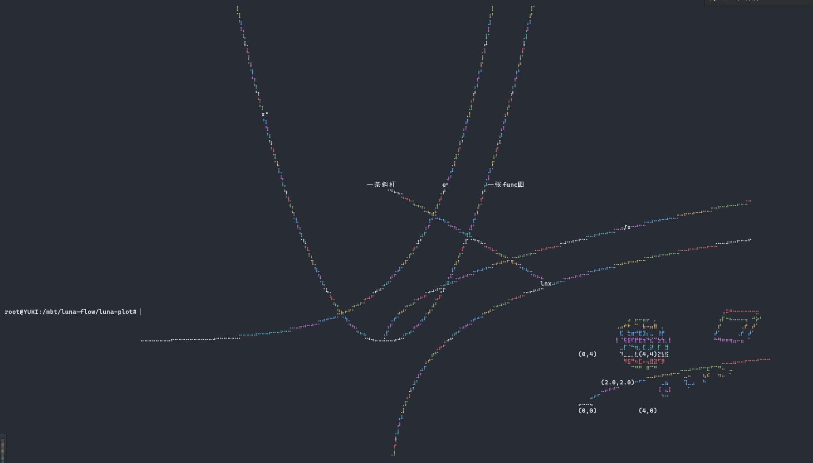

# Luna Plot
[简体中文](README.md) | [English](README_EN.md)

Luna Plot is a MoonBit-based data visualization library focused on providing clean and efficient functionality for charts, graphics, and view rendering.

## Features

1. Quick plotting of various function graphs with convenient labels and coordinate axis overlays
2. Simple 2D/3D engine based on function plotting engine
3. Basic animation output functionality (see examples in project)

## Dependencies and Setup

Install using MoonBit package manager:

```bash
moon add Kaida-Amethyst/math
moon add moonbitlang/x
```

## Quick Start

Run `./build.sh`. For manual compilation, uncomment the first line and update the native-zig compilation path to your local path (other backends are also supported):

```json
{
  "link": {
    "native": {
      "flags": [
        "-cc",
        "/D/zig/zig.exe cc -target riscv64-linux-musl -O2 -static"
        // Change this to your zig path
      ]
    }
  }
}
```

## Examples

See `src/main/main.mbt` for detailed code examples. Here are some visual demonstrations:


Basic single function plotting


Multiple function plotting


3D view and animation


Support for view embedding
